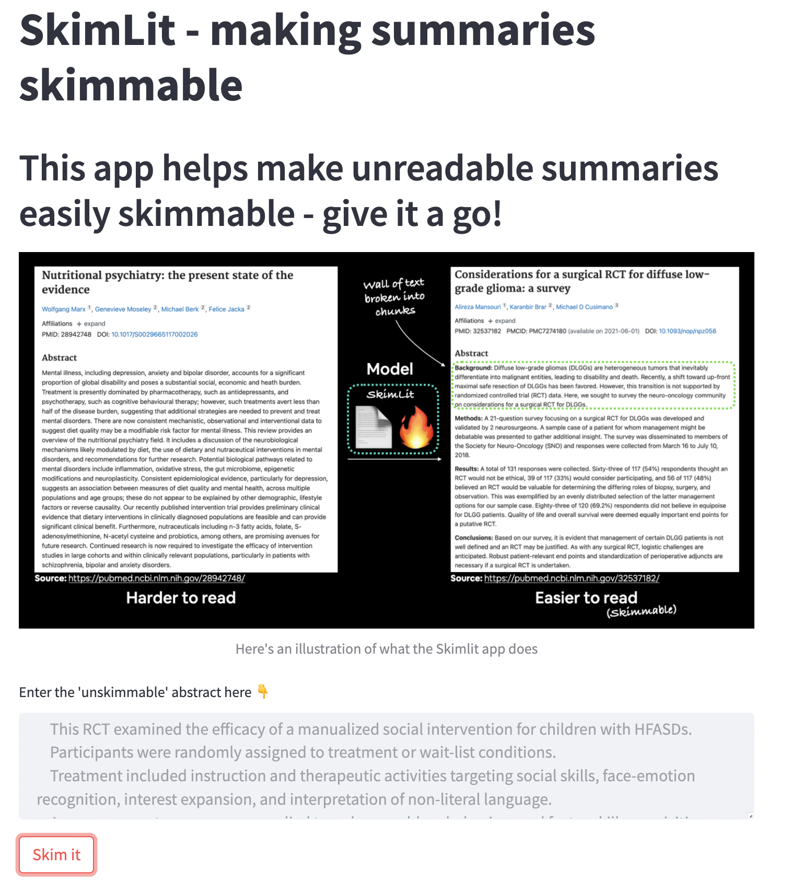

# <div align="center"> SkimLit </div>
<div align="center">


<br>
[](http://commonmark.org)


</div>
Welcome to the SkimLit application
<p align="center">
  
</p> <br>

The aim of skimlit is to make lengthy summaries skimmable to the eyes. Though abstracts are already summaries of their main documents, they can still be quite hard to read. Thankfully, AI can help! The experiments closely follow the paper [PubMed 200k RCT: a Dataset for Sequenctial Sentence Classification in Medical Abstracts](https://arxiv.org/abs/1710.06071), which is also the source of data for this project.

## The SkimLit app
To instantiate the environment, type the following commands in your terminal:
```git clone https://github.com/tituslhy/Skimlit```
```pip -r requirements.txt```

To run the backend (written with FastAPI), type the following commands in youer terminal:
```pip install "uvicorn[standard]"```
```uvicorn app:app --port 8000 --reload```

To run the frontend (written with Streamlit), open a new terminal instance and type the following command:
```streamlit run skimlit.py```

This launches the application's user interface. Feel free to interact with it! <br>

<p align="center">
  <kbd>
    
  </kbd>
</p> <br>

Users are encouraged to upload their unskimmable summaries to the text folder and click 'skim it'. This loads the model which will then be used to run an inference on the submitted text.<br>

<p align="center">
  <kbd>
    
  </kbd>
</p> <br>

A skimmable summary is then returned as an output to the user

## The model
Unfortunately the model size is too large and will not be committed on github. Do reach out to me if you would like to have it! The model architecture (specifics are available in utils/utils.py under the 'build_model' function) is: <br>
<p align="center">
  
</p> <br>

All experimented models are trained over 3 epochs. A summary of experimented models and their validation accuracy are as follows:
<br>
<table>
  <thead align="center">
    <tr border: none;>
      <td><b>Experiment</b></td>
      <td><b>Model</b></td>
      <td><b>Validation accuracy (on 15% of test data)</b></td>
      <td><b>Findings</b></td>
    </tr>
  </thead>
  <tbody>
    <tr>
        <td><b>Naive-Bayes TF-IDF Classifier</b></a></td>
        <td>This is the baseline model which serves as the benchmark to all other models experimented.</td>
        <td>72.2%</td>
        <td>The baseline model has a surprisingly good score!</td>
    </tr>
    <tr>
        <td><b>Conv1D on Word embeddings</b></a></td>
        <td>Learned a 128 dimension embedding for each word in vocabulary and added a Conv1D layer on top with an n-gram of 5</td>
        <td>79.7%</td>
        <td>This was the second best performing model. Word embeddings are clearly very important in helping the model understand sentence classification in an abstract.</td>
    </tr>
    <tr>
        <td><b>Universal Sentence Encoder (USE) and Conv1D layer on word embeddings</b></a></td>
        <td>Using USE word embeddings from tensorflow hub, we add a Conv1D layer on top with an n-gram of 5, and fit to the dataset. Word embeddings layer was frozen.</td>
        <td>71.2%</td>
        <td>Performance was expectedly poorer because there are fewer parameters to train, given that the embeddings layer was frozen.</td>
    </tr>
    <tr>
        <td><b>Conv1D character embeddings</b></a></td>
        <td>This model is focused on character embeddings only. We learn a 28 dimension embedding for each character including [UNK].</td>
        <td>65.2%</td>
        <td>Performance is the worst here, indicating either that we need a more sophisticated model to learn character embeddings adequately, or that character embeddings simply are not the ideal for this task.</td>
    </tr>
    <tr>
        <td><b>Combining USE Sentence Encoder and Conv1D word embeddings with Conv1D character embeddings </b></a></td>
        <td>This is a hybrid model of the previous 2 approaches.
        </td>
        <td>73.1%</td>
        <td>Performance barely beats the baseline - this is likely because the learning of character embeddings pulled the validation accuracy down.</td>
    </tr>
    <tr>
        <td><b>Tribrid model with USE word embeddings, character embeddings and sentence positioning embeddings</b></a></td>
        <td> We derive the sentence's position as an embedding for each sentence in each abstract, and the total abstract length as another embedding input to the USE word-char hybrid model before. This model now takes in 4 tensor inputs (words, characters, sentence position in abstract and total lines in abstract)
        </td>
        <td>83.0% (final testing accuracy after 5 epochs: 84.8%)</td>
        <td>This finding shows that sentence position is very important in its classification.</td>
    </tr>
